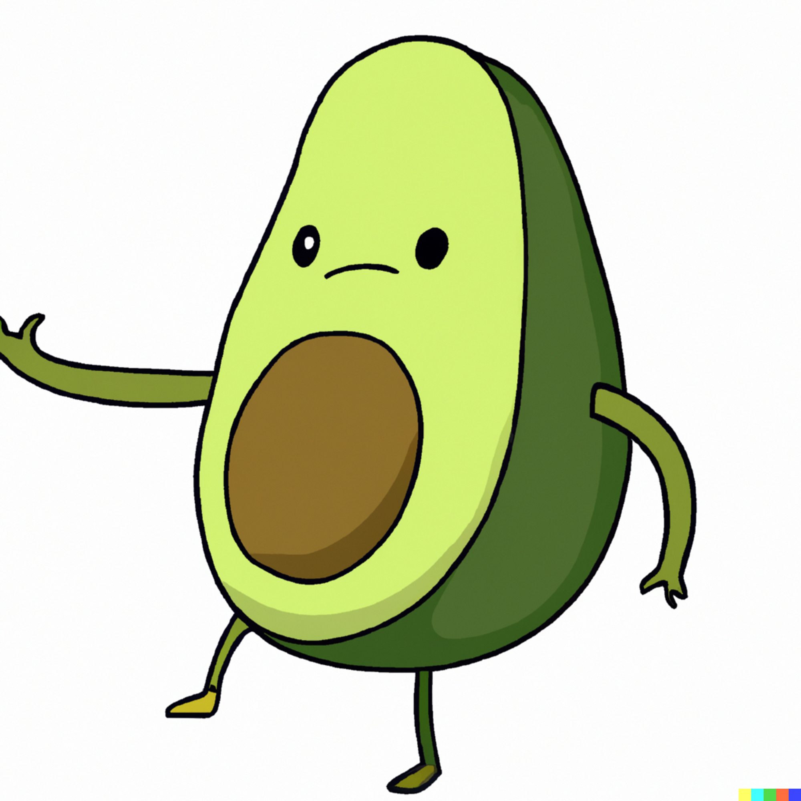
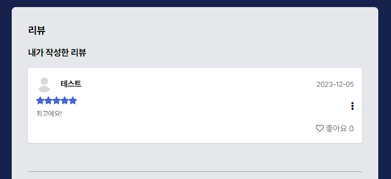

# BavoPeng
`보안상의 이유로 소스코드는 없습니다`
> 삼성 청년 SW 아카데미 (SSAFY) 10기 관통 PJT  
> 영화 추천 알고리즘 기반 커뮤니티 서비스  
> 2023.11.16 ~ 2023.11.24

### TOC
1. [🤝TEAM](#team)
2. [🛠️기술 스택](#%EF%B8%8F기술-스택)
3. [🏷️역할분담](#%EF%B8%8F역할분담)
4. [📐ERD](#erd)
5. [🎬Overview](#overview)
    - [영화 추천](#영화-추천)
    - [회원 정보](#회원-정보)
    - [영화 상세](#영화-상세)
    - [영화 리뷰](#영화-리뷰)
    - [커뮤니티](#커뮤니티)
    - [프로필](#프로필)
    - [네비게이션바](#네비게이션바)
    

## 🤝TEAM
|||
|:--:|:--:|
|김해인(팀장)|강성은(팀원)|

## 🛠️기술 스택
### Tools

### Frontend

![Pinia](https://img.shields.io/badge/pinia-52CE63?style=for-the-badge&logo=data%3Aimage%2Fpng%3Bbase64%2CiVBORw0KGgoAAAANSUhEUgAAAC0AAAAtCAYAAAA6GuKaAAAACXBIWXMAAAsTAAALEwEAmpwYAAAAAXNSR0IArs4c6QAAAARnQU1BAACxjwv8YQUAAAfsSURBVFjD7Zl%2FjFxVFcc%2F572ZeTOzM7OzS4tAl7a0QimhUMsKFQRLQAyVQClUjE2srRWjkWgiJCQSMBHEHwkEJCRUpYA2YiM0YkJiE7EikkJsC1IjbSlCLaXYbnfb2fn53jvHP2bm7c7sEn69JfzhS25y77x77%2Fme7z33%2FHgD%2F386n9uG7i38aO8DvXHv60wV4B8euu%2B0dMPbSpanbhu6t%2FCRB337f%2B6a4ddts6%2BN%2BQ31FyWq7tc%2B8qCrZj%2Fz1Z%2FVCH189Wngr41zf4kb8E2v3rlCRDaKNLeXlhgxZ%2F6dp9z4chwyEnECvvHFG3sCDe5AWmxIBBlErgQ%2BfNDLd6y%2BnlA%2Ba8orjtmWx85dvxnB2u9r2ewXscapYuPAIk3swoK4yHnXoJc%2Fv3oOPvej5oqBmd28%2FG%2BrXuNpu%2BPxix75BYCvjbWYRCxH0AVMWfihg7Z6eIYgLgamIGagzDazny%2F745cv7p1WvKsR%2BIsnAB4bf6x7z8vvvdxLzes9XhJeamSOvLHllIdqMYO2eQiIAmaYAWpgIKpfqpRGP%2BOleqKr12Y4GoeWBFi2fllR0umvk5IlpJzLBMfBMfoPSG3581%2F93OPn%2FvLp2EBLQA%2BmHWAZ33eZEWhAh88YdxFN8K95%2BLqbTOxmU%2BtHpaW8gQlipDE9DYgPNKE2CCYB2%2BqHYmjog3Q4ugi8VcPpKvaTzuMDae%2FRxL4nVvOQmr1hqqBtIdbZTwpGUxEbcygROCv748bWatI8uabiIaY7YwXtVv0XAnFawlqCOia8wwb1sEOJSNl2U57ZdN4jQ7GG8SAMDhDoUMTue42tlS7QSnRSYoDqw7G7vE2rNg1d%2FasVL2Es6X6XTThcmEmwMJ1gwBUSAjWDQ6Hy93rI9krI4ap2mUzTPFADZd9wObFpSiKiOe6vJdQIdDElfH5mD1ecnMFzJlI9K%2BEy6LmEefhTCBv2lin5Os5EDBDM5J4tVz80MmUJ09WPrDgAcuKsXILvnd3LtLT7rtcON5TbXzjKv0s%2BOAIpgZSza99AbsG2wXX%2BlKWmDrJ2YX%2BKO87p6wRcPQrVLrKqI1AZjoZ9KYcfLCpy3nSPlo8JwsC%2B8F4Avy%2FQv7tk%2BsGbFvRqttuwUhkYPgDllgOoHYORg5Dq6bJ%2F4btn9nJGMWngrHni2t%2F8Y0rzaduzskC6dwfYHKL8c7yLqcOhvZApQLUE0%2BdC0ptUVMXXN7ME58jsdW9ObeWSyt2ChXMwbWZN2mrtsZuE7HFQGoKe%2FuZYrRU9taNlE3IiieSdU1q52KvfmIcTvIjgve3y%2BmjTRIonwrG3oPcESOcnzo26ohCeLyeve25qmJbGrZh6EbuqoGEngxrCtFng5aB%2FJmgwgeHohEzBQgfjtilh2t5cPZ2avY5JZuxGnQXeXGjsh8q2rjA5CavJEyCsgJY65wkNGpW5cuqG%2FfEyXQ2vQjUTMZW7gOde%2BxSXXnsP920MIX%2FJRPtuN%2Bkh6P82G585i23%2FXQm5C7pZT5Hw1sZvHmrXdYDKLmT37t2sXLmSG264gWMMdoEdZzbp03l2xzCFQoHBwUF27p8PpMfNCwG7LH7QYXhhJEQV%2FMPs27ePNWvWsHTpUgreEBM8irbmOnm2b9%2FO3XffDcBoNQBxuk9mnu1ZMT02m7adK2aSdF%2BPxmGa8sgVeB%2B%2FjNdGDjLjuCrZYw%2FiV9%2FirvUv851Vp%2BOlHJ7ccoClS2ZAosBw%2FmY2PPoEAwMDLLs4DYc2TBSf9BfJ7Ed3xJMwGeegGsnQIIl%2FJEv1r7vpcxzck%2F4AvQdJOsKVS07ixw%2F8k1CVTw8e32TRH6F36D5WLb6esBJyeMswuZNOJV3c1SnHdxYDMYEWZmBjmZmbGKZvzoNYmMFwcBKVyHHMn5Pj1m%2FOH3cXmjm0I%2FtI%2BI8h4TQSfTWSmTcYT0Sr8J0ZX2qqQa79pahDF6fcrAF1QsDoND4TwMj0bWsqJxIVhFGK2nx64gPtmqD2NrdAOvtmdCjYXmbyzldKcWNk2m9gDqpGGPgkPW9yodYGrpMEl655Ipgafr1KKpONSucYQTsjoIgZ5eFhMvk8XmYsMNbKZVKZDI7rjreJDpCNWhVxHJJeOvqtPNzMs1NeurkklCMx%2BulwJ6qIQL6vj8rRo9SrFTClWipRr1SaPKp2Bowo0BiO4zB65AhhowGmVI6OICi5YnHMtzvBizHWiMFOTHyMpOtCob%2FI6Mgx%2FGqNIAgo9BebH07bnxYisxgziUTCpdDXR2noMG4yiQjkin2taNj6fhXoS7ExLWdvLoP9pcmI4ToOqbRHvVYjk83itD6JdjS6sznFTbi4yQSNWo10Tw%2Ft%2FZrKhltl0ZOvx5x7BD9tH329VqVerZHvzVMtl2nUahMAdoToVr9SKqFBQE%2B%2Bh9GRo2gYtNKCEMTujz33kMGnNqO6FVMsVPKFLKmkSy6foVwqEzQaY3nJJIlTtVyhUa9TKBZIZ9Jksmk0aOXa2Auctfi3U1ME%2BPWrUHsl7SVwWyaRcB1yuTSjpTKm3Sw3ATdqdeq1GoXeXNP2NcRLJUm4DoT6FkF4jcj3deoK263nDYD3JNiC8UvNDHFk0u0supfSLXYrwlfkk3%2FeNaWFrSx%2Bbj9VZxFq3wLd0zaDyHt0mEezmJX2%2B%2FYJYC9jdgte8tL3A%2FgD%2FyVnz170CdDzQRchzpmYDSCWxsRBUKCKcQBjF47zL0L9Penabhnc5n8Quf8DA5tQI5aiLr8AAAAASUVORK5CYII%3D)

<!--  -->

### Backend

## 🏷️역할분담
|이름|역할|
|:--:|----|
|ê¹€í•´ì¸ ( BE, FE )|- ERD 설계  - Django ( accounts, articles )  - Vue ( 로그인, 회원가입, 프로필 )  - CSS  - ppt제작, 발표|
|ê°•ì„±ì€ ( BE, FE )|- Open API 요청, DB 저장  - Django ( movies )  - Vue ( 영화, 리뷰, 게시글, 댓글, 검색 )  - 영화 추천 알고리즘  - CSS|

## 📐ERD

## 🎬Overview
### 영화 추천
|로그인|비로그인|
|:--:|:--:|
| ||

<!-- |상태|화면|
|:--:|:--:|
|로그인| |
|비로그인|| -->

### 회원 정보
|회원가입|로그인|취향 선택|
|:--:|:--:|:--:|
||||

### 영화 상세
|기본정보 / 스코어 / 커뮤니티 태그|줄거리 / 예고편 / 출연진|
|:--:|:--:|
|  ||

### 영화 리뷰
|내가 작성한 리뷰|전체 리뷰|리뷰 작성|
|:--:|:--:|:--:|
| |||

<!-- |내용|화면||
|:--:|:--:|:--:|
|영화|  ||
|리뷰| ||
|리뷰 작성||| -->

### 커뮤니티
|전체 게시글|게시글 상세|게시글 작성|
|:--:|:--:|:--:|
||||

### 프로필
|내 프로필|프로필 수정|
|:--:|:--:|
| ||

|팔로우 / 언팔로우|좋아하는 영화 / 보고싶은 영화|
|:--:|:--:|
| | |

### 네비게이션바
|로그인|비로그인|
|:--:|:--:|
| | |

