# 푸른 : 아이와 함께 성장하는 화분
> 삼성 청년 SW 아카데미 (SSAFY) 10기 공통 PJT  
> 식물상태 정보 제공 및 아이와 소통이 가능한 스마트 화분  
> 2024.01.08 ~ 2024.02.16 (6주)  
> [🔗 푸른 Notion 바로가기](https://pengisblue.notion.site/E101-132c697bfe734b22b0640fc0aaec8c80?pvs=4)

### TOC
1. [TEAM](#팀소개)
2. [서비스 소개](#서비스-소개)
3. [UCC](#ucc)
4. [Overview](#overview)
    - [홈화면](#홈화면)
    - [화분 정보](#화분-정보)
    - [아이 정보](#아이-정보)
    - [대화](#대화)
    - [컬렉션](#컬렉션)
5. [기술 스택](#기술-스택)
    - [아키텍처](#아키텍처)
    - [통신 환경](#통신-환경)
4. [Commit Convention](#commit-convention)

## 팀소개

|김해인 (팀장)|한성주 (팀원)|김연빈 (팀원)|이동호 (팀원)|최진우 (팀원)|박종국 (팀원)
|:--:|:--:|:--:|:--:|:--:|:--:|
|Frontend|Embedded|Embedded|Frontend|Backend|Backend|

## 서비스 소개

### 아이와 대화하기
호출어 ("푸른아!")로 푸른이를 부를 수 있습니다. 

안내음이 들린 뒤 말을 걸면, 푸른이가 친절하게 대답해줍니다. 응답을 들은 뒤 다시 말을 걸어 대화를 이어갈 수 있습니다. 

웹에서는 아이와 화분이 나눈 대화를 텍스트와 음성으로 확인할 수 있습니다.

### 온도, 습도 관리
화분을 등록하고 관리할 수 있습니다. 

현재의 온도, 습도와 어제의 상태를 그래프로 확인하고 관리할 수 있게 돕습니다. 

만약 등록한 식물이 적정 온도나 습도를 벗어나는 경우. 화분의 표정이 변화하여 간단하게 상태를 파악할 수 있습니다. 

### 기타 상호작용
가까이 다가가면 손을들어 인사해줍니다.! 
아주아주 귀엽습니다.

## UCC
### [푸른이의 하루 보러가기!](https://youtu.be/fuwtwcdx7YY?si=M9KMLYXY5HIp1sCQ)

## Overview
### 홈화면
|부모|키즈모드|
|:--:|:--:|
|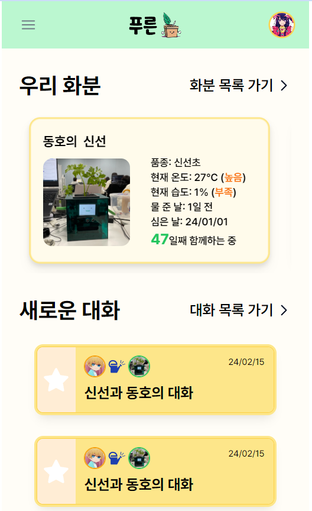|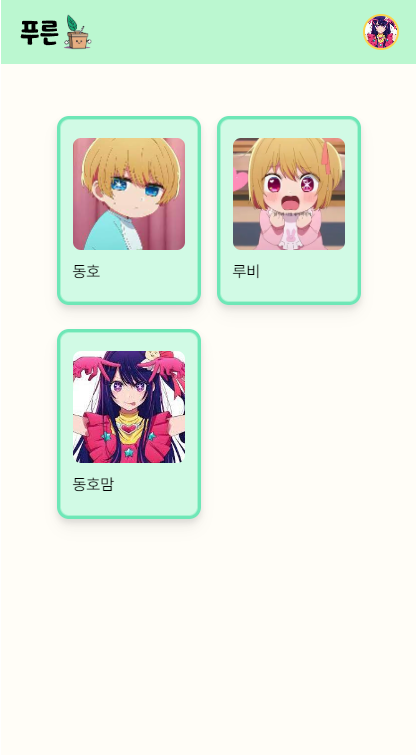|

### 화분 정보
|부모 - 화분목록|부모 - 화분상세|키즈모드 - 화분|
|:--:|:--:|:--:|
|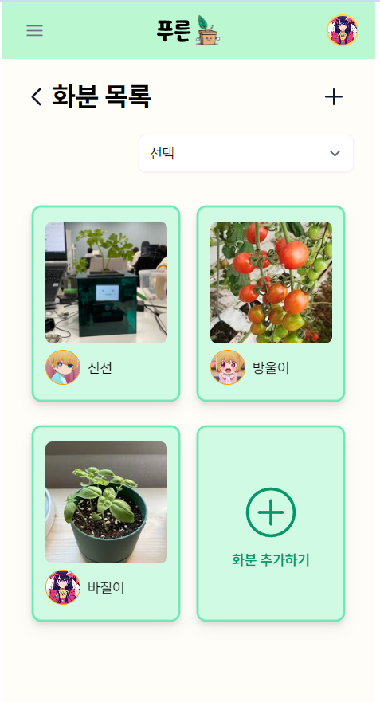|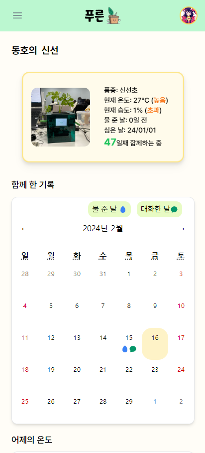|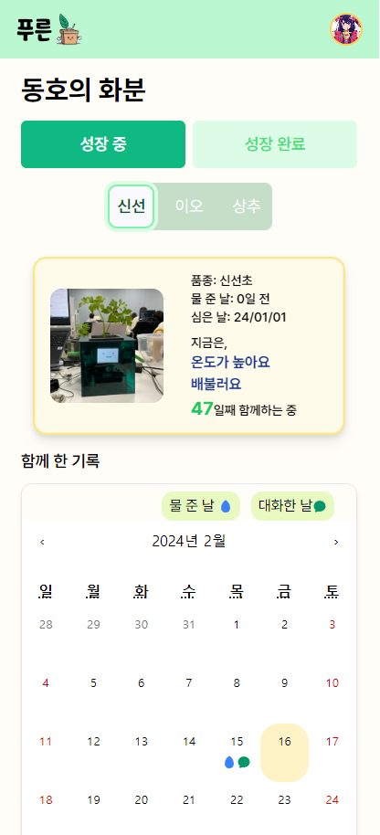|

### 아이 정보
|아이 목록|아이 상세|
|:--:|:--:|
|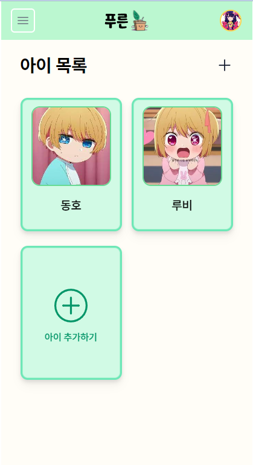|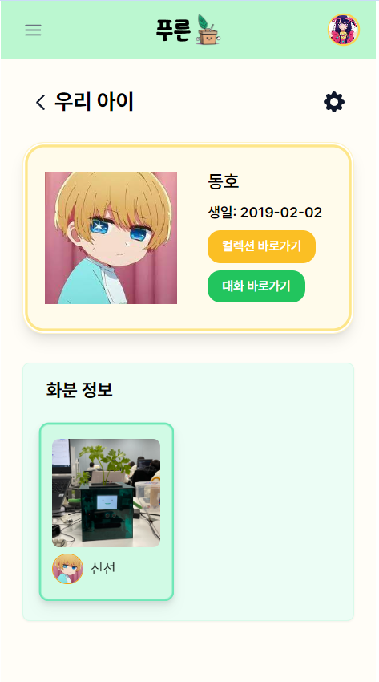|

### 대화
|대화 목록|대화 상세|
|:--:|:--:|
|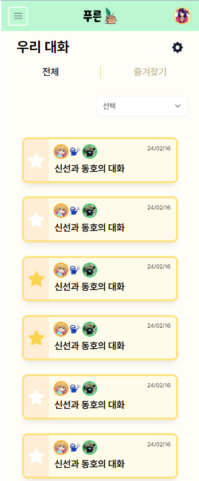|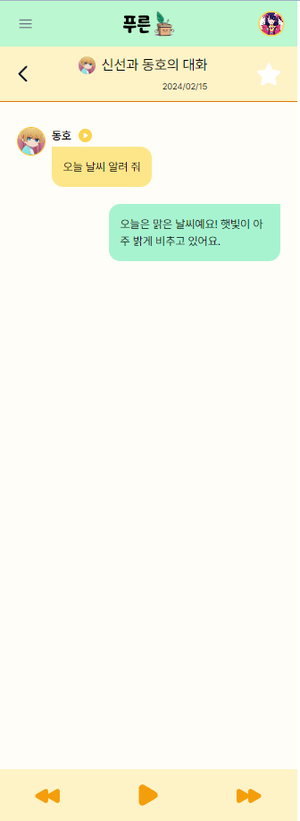|

### 컬렉션
|부모 - 컬렉션|키즈모드 - 컬렉션|
|:--:|:--:|
|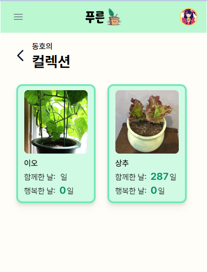 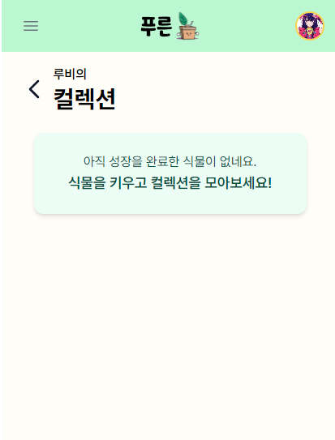|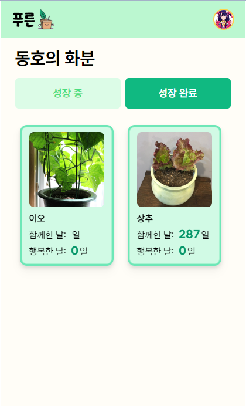|

## 기술 스택
### ⚙ Management Tool

### 💻 IDE

### 🔑 Infra

### 🥽 Embedded

### 📱 FrontEnd

### 📋 BackEnd

### 아키텍처

### 통신 환경

## Commit Convention

|Tag Name|Description|
|:--:|:--|
|feat|새로운 기능을 추가|
|fix|버그 수정|
|design|CSS 등 사용자 UI 디자인 변경|
|!BREAKING CHANGE|커다란 API 변경|
|!HOTFIX|급하게 치명적인 버그를 고쳐야하는 경우|
|style|코드 포맷 변경, 세미 콜론 누락, 코드 수정이 없는 경우|
|refactor|프로덕션 코드 리팩토링|
|comment|필요한 주석 추가 및 변경|
|docs|문서 수정|
|test|테스트 코드, 리팩토링 테스트 코드 추가,  Production Code(실제로 사용하는 코드) 변경 없음|
|chore|빌드 업무 수정, 패키지 매니저 수정, 패키지 관리자 구성 등 업데이트,  Production Code 변경 없음|
|rename|파일 혹은 폴더명을 수정하거나 옮기는 작업만 수행한 경우|
|remove|파일을 삭제하는 작업만 수행한 경우|